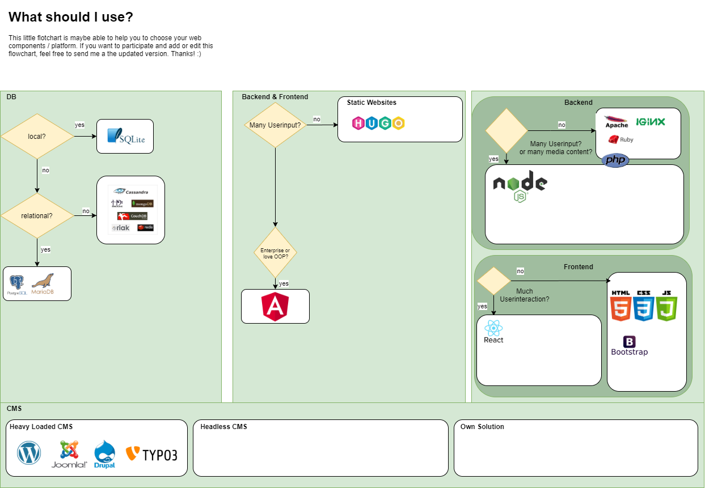

# Web - A little Overview

## Server - Backend

### Webserver

* Apache Server
* NginX

### Runtimes

* Ruby
* NodeJS
* PHP

### DB

#### Relational:
  
* Postgress SQL
* Maria DB
* Oracle DB

#### NOSQL

* NodeJS
* Cassandra
* MongoDB
* ...

## Client - Frontend

* React
* Bootstrap
  
## Both

* AngularJS
* Hugo

## CMS

### Headless CMS

### Heavy CMS

* Wordpress
* Drupal
* Typo3
* Joomla

